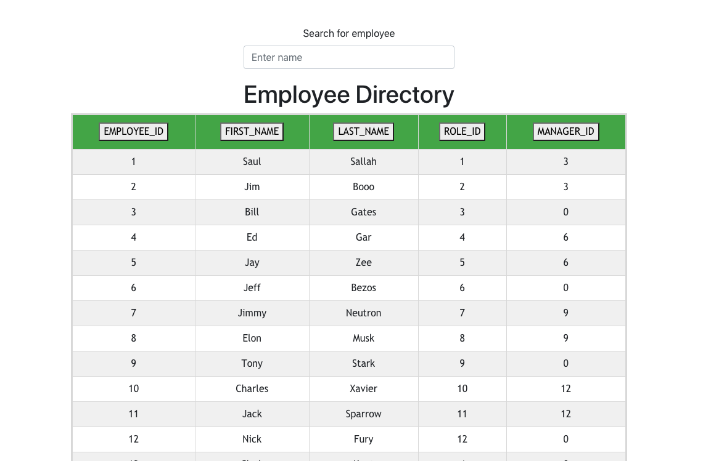

# React: Employee Directory

## Overview

Created an employee directory with React. Broke up the application's UI into components, manages component state, and responds to user events.

## Screenshot

## User Story

* As a user, I want to be able to view my entire employee directory at once so that I have quick access to their information.

## Business Context

An employee or manager would benefit greatly from being able to view non-sensitive data about other employees. It would be particularly helpful to be able to filter employees by name.

## Use

The user can:

  * Sort the table by any category

  * Filter the users by name

## Deployment & Repo

[Heroku Deployment](https://agile-sands-37363.herokuapp.com/)

[GitHub Repo](https://github.com/Saulstice/reactEmployees)

